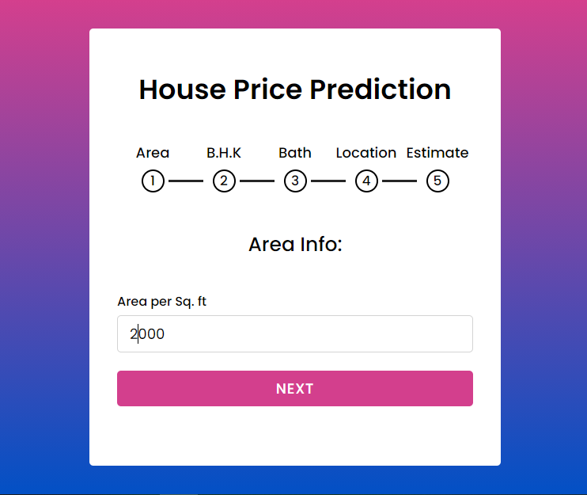
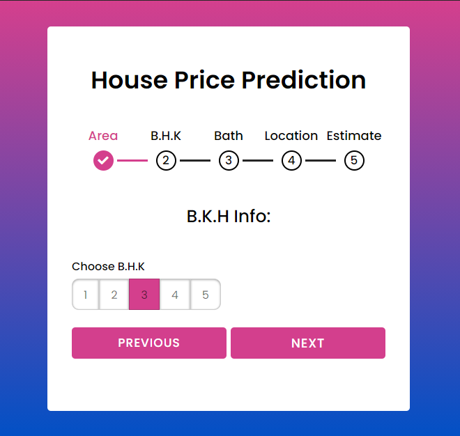
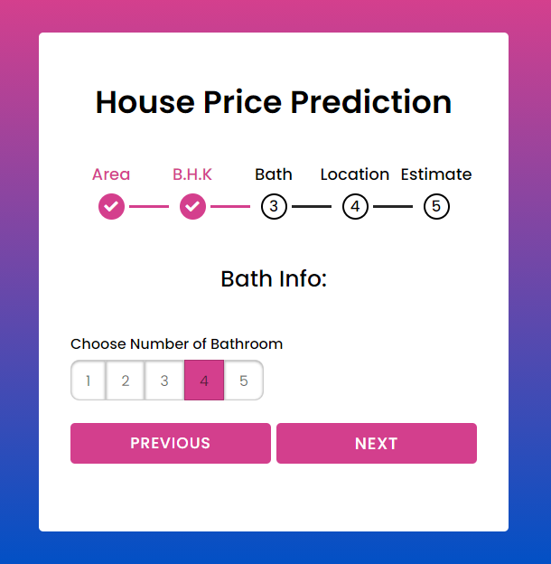
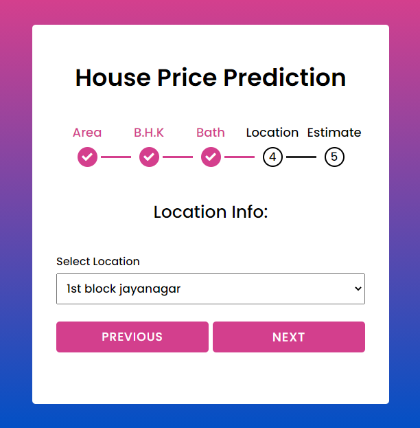
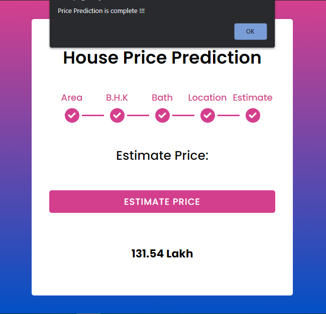

# HousePricePrediction

<h3>The flask Python website that predict price of a house/property using a machine learning model.</h3>
<ul>
<li>First we build a model using sklearn and linear regression using banglore home prices dataset from kaggle.com.</li>
<li>Second we write a python flask server that uses the saved model to serve http requests.</li>
<li>Third component is the website built in html, css and javascript that allows user to enter home square ft area, bedrooms etc and it will call python flask server to retrieve the predicted price.</li>
</ul>

<h3>Technology used</h3>
<ul>
  <li>Machine Learning</li>
  <li>Python</li>
  <li>Flask</li>
  <li>HTML | CSS | Java Script</li>
</ul>

To run this website on your local machine, You need to install requirements.txt by using 
<b><i>pip install -r requirements.txt<i></b> command. 
After installing above dependencies you can run the server using 
  <b><i>$ python server.py</i></b> 
and open app.html on any browser. 

<h2>Screen Shots<h2>
 
 
 
 
  

